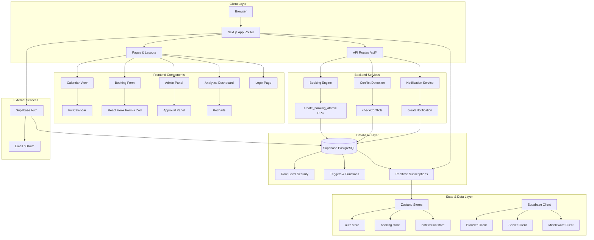
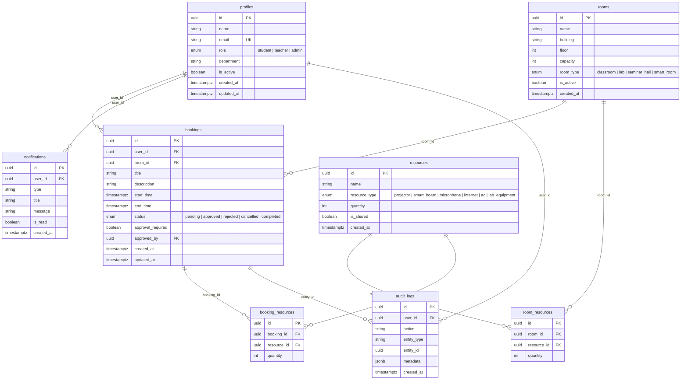
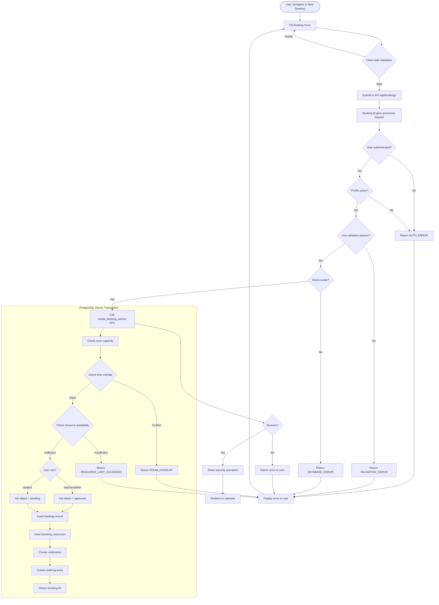
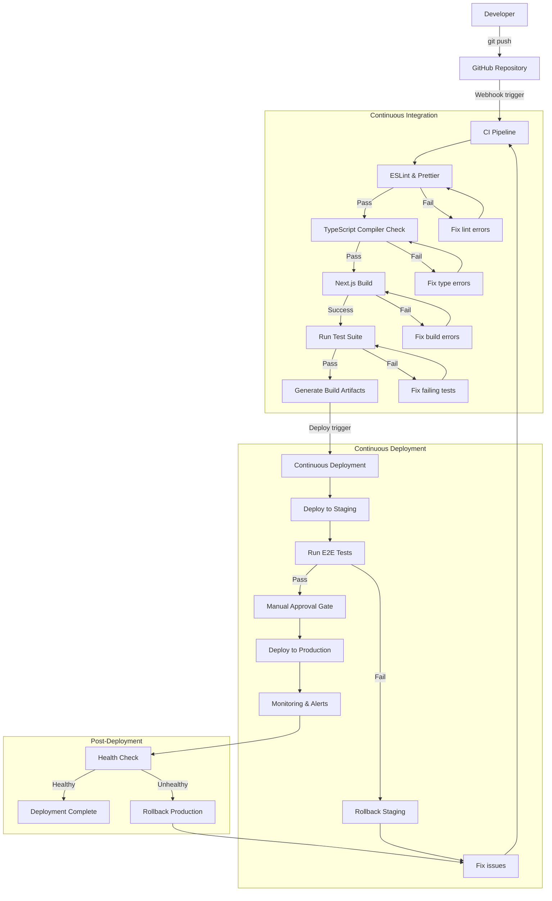

# ClassSync


## Table of Contents

- [Project Overview](#project-overview)
- [Features](#features)
- [Tech Stack](#tech-stack)
- [Architecture](#architecture)
  - [System Architecture Diagram](#system-architecture-diagram)
  - [Database Schema](#database-schema)
- [Workflow](#workflow)
  - [Booking Lifecycle](#booking-lifecycle)
  - [CI/CD Pipeline](#cicd-pipeline)
- [Installation](#installation)
- [Quick Start](#quick-start)
- [Usage](#usage)
  - [Creating a Booking](#creating-a-booking)
  - [Admin Approval Workflow](#admin-approval-workflow)
  - [Analytics Dashboard](#analytics-dashboard)
  - [API Reference](#api-reference)
- [Configuration](#configuration)
- [Project Structure](#project-structure)
- [Testing](#testing)
- [Contributing](#contributing)
- [License](#license)
- [Contact / Support](#contact--support)

## Project Overview

ClassSync is a full-stack classroom and resource booking platform purpose-built for educational institutions. It replaces fragmented scheduling systems — spreadsheets, email chains, paper sign-up sheets — with a unified, real-time booking engine that eliminates double-booking and resource conflicts.

The platform supports three distinct user roles — **students**, **teachers**, and **administrators** — each with tailored permissions and workflows. Students submit booking requests that require admin approval, while teachers and admins enjoy instant auto-approval. Every booking action is validated against room capacity, time-slot availability, and shared resource inventory through an atomic PostgreSQL transaction.

Built on **Next.js 14** with the App Router and **Supabase** for authentication, database, and real-time subscriptions, ClassSync delivers a responsive, mobile-friendly interface with an interactive calendar, live notifications, and an admin analytics dashboard. The entire codebase is written in **TypeScript** with **Zod** schemas for runtime validation and **Zustand** for client-side state management.

## Features

### Core Booking Engine
- **Atomic Conflict Detection** — Server-side PostgreSQL function (`create_booking_atomic`) validates room availability, resource inventory, and time-slot overlaps in a single database transaction, preventing race conditions.
- **Capacity Validation** — Automatically checks room capacity against the number of attendees before confirming a booking.
- **Resource Inventory Management** — Tracks shared resources (projectors, smart boards, microphones, lab equipment, air conditioners, internet access) with per-room assignments and real-time availability checks.
- **Time-Range Validation** — Enforces that end time must be after start time, with configurable booking duration limits.

### Role-Based Access Control
- **Three-Tier Role Model** — `student`, `teacher`, and `admin` roles with distinct permissions enforced through Supabase Row-Level Security (RLS) policies.
- **Auto-Approval for Faculty** — Teachers and administrators receive instant booking approval; student bookings enter a pending state requiring admin review.
- **Profile Management** — Automatic profile creation on signup via a database trigger, with support for department assignment and account activation/deactivation.

### User Interface
- **Interactive Calendar** — FullCalendar integration with month, week, and day views. Users can browse room availability, view existing bookings, and click to create new bookings directly from the calendar.
- **Booking Form** — React Hook Form with Zod validation, featuring room selection with capacity display, date-time pickers, and dynamic resource quantity selectors.
- **Real-Time Notifications** — In-app notification system powered by Supabase Realtime, alerting users on booking creation, approval, rejection, cancellation, and conflicts.
- **Responsive Design** — Tailwind CSS with dark-mode-ready styling, optimised for desktop, tablet, and mobile viewports.

### Admin Capabilities
- **Approval Panel** — Dedicated admin interface to review, approve, or reject pending bookings with a single click.
- **Analytics Dashboard** — Recharts-powered visualisations showing room utilisation rates, booking volume trends, peak usage hours, and resource allocation metrics.
- **Audit Trail** — Every booking action (create, approve, reject, cancel) is logged with user identity, timestamp, and metadata for compliance and troubleshooting.

### Security & Compliance
- **Row-Level Security** — All database tables have RLS policies ensuring users can only access their own data, with admin override policies.
- **Input Validation** — Zod schemas validate all form inputs on both client and server sides, preventing malformed or malicious data.
- **Session Management** — Supabase SSR middleware handles cookie-based session refresh and protects authenticated routes.

## Tech Stack

| Layer | Technology | Purpose |
|-------|-----------|---------|
| **Framework** | Next.js 14 (App Router) | Server-side rendering, API routes, file-based routing |
| **Language** | TypeScript 5.x | Type safety across the entire codebase |
| **Database** | Supabase (PostgreSQL) | Relational data store with RLS and real-time subscriptions |
| **Authentication** | Supabase Auth | Email/password and OAuth authentication with SSR cookie management |
| **ORM / Client** | Supabase JS Client (`@supabase/ssr`, `@supabase/supabase-js`) | Database queries, RPC calls, and real-time listeners |
| **State Management** | Zustand 5.x | Lightweight client-side store for auth, bookings, and notifications |
| **Form Validation** | React Hook Form + Zod 4.x | Performant form handling with schema-based validation |
| **Calendar UI** | FullCalendar 6.x | Interactive calendar with month, week, and day views |
| **Charts** | Recharts 3.x | Admin analytics visualisations |
| **Styling** | Tailwind CSS 3.4 | Utility-first responsive design |
| **Animations** | Framer Motion 12.x | Page transitions and micro-interactions |
| **Notifications** | Sonner 2.x | Toast notifications for user feedback |
| **Icons** | Lucide React | Consistent iconography across the UI |

## Architecture

### System Architecture Diagram



### Database Schema



## Workflow

### Booking Lifecycle



### CI/CD Pipeline



## Installation

### Prerequisites

- **Node.js** 18.x or later (LTS recommended)
- **npm** 9.x or later (or pnpm / yarn as alternatives)
- A **Supabase** project — create one free at [supabase.com](https://supabase.com)
- **Git** for version control

### Step-by-Step Setup

1. **Clone the repository**

   ```bash
   git clone https://github.com/SairajMN/ClassSync.git
   cd ClassSync
   ```

2. **Install dependencies**

   ```bash
   npm install
   ```

   This installs all runtime and development dependencies including Next.js, Supabase client libraries, FullCalendar, Recharts, Zustand, Zod, and Tailwind CSS.

3. **Configure environment variables**

   ```bash
   cp .env.example .env.local
   ```

   Open `.env.local` and fill in your Supabase project credentials (see [Configuration](#configuration) section).

4. **Run database migrations**

   ```bash
   npx supabase db push
   ```

   This applies the migration in `supabase/migrations/001_init.sql` which creates all tables (profiles, rooms, resources, room_resources, bookings, booking_resources, notifications, audit_logs), enables Row-Level Security, creates RLS policies, and installs the `create_booking_atomic` PostgreSQL function.

   Alternatively, copy the contents of `supabase/migrations/001_init.sql` and execute it directly in the Supabase SQL Editor via the dashboard.

5. **Seed sample data (optional)**

   ```bash
   npx supabase db seed
   ```

   This populates the database with three sample rooms (Smart Room A, Lab 3, Seminar Hall), six resource types (projector, smart board, microphone, internet, AC, lab equipment), and their room-resource assignments. Auth users must be created through the Supabase dashboard or signup API — the `on_auth_user_created` trigger automatically creates corresponding profile records.

## Quick Start

Start the development server:

```bash
npm run dev
```

The server starts at **http://localhost:3000**. You will be redirected to the login page. From there:

1. **Sign up** for a new account (or sign in if you already have one).
2. Your profile is automatically created with the `student` role by default.
3. Browse available rooms on the **Rooms** page.
4. Create a booking via the **New Booking** form or directly from the **Calendar** view.
5. If you are a student, your booking will appear as **pending** in the admin panel.
6. If you are a teacher or admin, your booking is **auto-approved** immediately.

To test the admin workflow, update your profile role to `admin` directly in the Supabase dashboard under the `profiles` table.

## Usage

### Creating a Booking

1. Navigate to **Bookings > New Booking** from the sidebar.
2. **Select a room** — the dropdown displays room name, building, floor, capacity, and room type. Only active rooms are shown.
3. **Enter a title** — a descriptive name for your booking (e.g., "CS101 Lecture", "Physics Lab Session").
4. **Pick start and end times** — use the datetime picker. The end time must be after the start time.
5. **Add resources (optional)** — click "Add Resource" to request additional equipment. For each resource, select the type and specify the quantity. The form validates that sufficient inventory is available.
6. **Submit** — the booking engine performs server-side validation:
   - **Teachers and admins** → booking is immediately approved with status `approved`.
   - **Students** → booking is created with status `pending` and requires admin approval.
7. On success, a confetti animation plays and you are redirected to the calendar view showing your new booking.

### Admin Approval Workflow

1. Navigate to **Admin Panel** from the sidebar (visible only to users with the `admin` role).
2. The **Approval Panel** displays all bookings with `pending` status, sorted by creation date (oldest first).
3. Each pending booking card shows:
   - Requester name and email
   - Room name and type
   - Booking title and description
   - Start and end times
   - Requested resources (if any)
4. Click **Approve** to confirm the booking — the status changes to `approved` and the requester receives an in-app notification.
5. Click **Reject** to decline — a confirmation dialog appears. On confirm, the status changes to `rejected` and the requester is notified.
6. All approval and rejection actions are logged in the `audit_logs` table with the admin's user ID and timestamp.

### Analytics Dashboard

1. Navigate to **Admin > Analytics** (admin role required).
2. The dashboard displays:
   - **Room Utilisation Rate** — percentage of available time slots that are booked, broken down by room.
   - **Booking Volume Over Time** — line chart showing the number of bookings created per day/week/month.
   - **Peak Usage Hours** — histogram of booking start times to identify high-demand periods.
   - **Resource Allocation** — pie chart showing which resources are most frequently requested.
   - **Approval Rate** — ratio of approved to rejected bookings over a configurable time period.
3. All charts are interactive — hover for tooltips, click legend items to toggle data series.

### API Reference

#### Bookings

| Method | Endpoint | Description | Auth Required |
|--------|----------|-------------|---------------|
| `GET` | `/api/bookings` | List all bookings for the authenticated user. Supports `?status=pending` and `?room_id=uuid` query filters. | Yes |
| `POST` | `/api/bookings` | Create a new booking. Body: `{ title, description?, room_id, start_time, end_time, resources? }` | Yes |
| `GET` | `/api/bookings/[id]` | Get a single booking by ID, including associated profile, room, and resource data. | Yes |
| `PATCH` | `/api/bookings/[id]` | Update a booking. Only pending bookings can be updated. Body: partial booking fields. | Yes |
| `POST` | `/api/bookings/check-availability` | Check room and resource availability for a time range. Body: `{ start_time, end_time, capacity?, resource_ids? }` | Yes |

#### Admin

| Method | Endpoint | Description | Auth Required |
|--------|----------|-------------|---------------|
| `POST` | `/api/admin/bookings/[id]/approve` | Approve a pending booking. Sets `status = approved` and `approved_by = current_user`. | Admin only |
| `POST` | `/api/admin/bookings/[id]/reject` | Reject a pending booking. Sets `status = rejected`. | Admin only |
| `GET` | `/api/admin/analytics` | Fetch aggregated booking analytics including utilisation rates, volume trends, and resource stats. | Admin only |

#### Response Format

All API responses follow a consistent structure:

```json
{
  "data": { ... },
  "error": null
}
```

On error:

```json
{
  "data": null,
  "error": {
    "code": "CONFLICT_ERROR",
    "message": "The room is already booked for the selected time range."
  }
}
```

Error codes: `AUTH_ERROR`, `VALIDATION_ERROR`, `CAPACITY_ERROR`, `CONFLICT_ERROR`, `DATABASE_ERROR`.

## Configuration

All configuration is managed through environment variables in `.env.local`. Copy `.env.example` to get started.

### Required Variables

| Variable | Description | Example |
|----------|-------------|---------|
| `NEXT_PUBLIC_SUPABASE_URL` | Your Supabase project URL | `https://xxxxx.supabase.co` |
| `NEXT_PUBLIC_SUPABASE_ANON_KEY` | Supabase anonymous (public) API key | `eyJhbGciOiJIUzI1NiIs...` |
| `SUPABASE_SERVICE_ROLE_KEY` | Service role key for admin-level operations | `eyJhbGciOiJIUzI1NiIs...` |
| `NEXT_PUBLIC_APP_URL` | Public URL of the deployed app | `http://localhost:3000` |

### Where to Find Supabase Credentials

1. Log in to [supabase.com/dashboard](https://supabase.com/dashboard).
2. Select your project.
3. Go to **Project Settings > API**.
4. Copy the **Project URL**, **anon public key**, and **service_role key**.

> **Security Note:** The `SUPABASE_SERVICE_ROLE_KEY` bypasses Row-Level Security. Never expose it to the client or commit it to version control. It is used only in server-side API routes and middleware.

## Project Structure

```
ClassSync/
├── app/                          # Next.js App Router
│   ├── (auth)/                   # Authentication routes
│   │   └── login/
│   │       └── page.tsx          # Login/signup page
│   ├── (dashboard)/              # Protected dashboard routes
│   │   ├── admin/
│   │   │   └── page.tsx          # Admin panel (approvals + analytics)
│   │   ├── bookings/
│   │   │   └── new/
│   │   │       └── page.tsx      # New booking form
│   │   ├── calendar/
│   │   │   └── page.tsx          # Interactive calendar view
│   │   ├── dashboard/
│   │   │   └── page.tsx          # User dashboard
│   │   ├── rooms/
│   │   │   └── page.tsx          # Room listing
│   │   └── layout.tsx            # Dashboard layout (sidebar + navbar)
│   ├── api/                      # API route handlers
│   │   ├── admin/
│   │   │   ├── analytics/
│   │   │   │   └── route.ts      # GET analytics data
│   │   │   └── bookings/[id]/
│   │   │       ├── approve/
│   │   │       │   └── route.ts  # POST approve booking
│   │   │       └── reject/
│   │   │           └── route.ts  # POST reject booking
│   │   └── bookings/
│   │       ├── route.ts          # GET/POST bookings
│   │       ├── [id]/
│   │       │   └── route.ts      # GET/PATCH booking by ID
│   │       └── check-availability/
│   │           └── route.ts      # POST availability check
│   ├── globals.css               # Global styles + Tailwind imports
│   ├── layout.tsx                # Root layout with fonts
│   └── page.tsx                  # Landing page
├── components/                   # Reusable React components
│   ├── admin/
│   │   ├── AnalyticsDashboard.tsx # Recharts visualisations
│   │   └── ApprovalPanel.tsx     # Pending bookings management
│   ├── booking/
│   │   └── BookingForm.tsx       # Booking creation form
│   ├── calendar/
│   │   └── BookingCalendar.tsx   # FullCalendar wrapper
│   ├── rooms/
│   │   └── RoomCard.tsx          # Room display card
│   └── shared/
│       ├── Navbar.tsx            # Top navigation bar
│       └── Sidebar.tsx           # Side navigation menu
├── hooks/                        # Custom React hooks
│   ├── useAvailability.ts        # Room availability queries
│   ├── useBookings.ts            # Booking CRUD operations
│   ├── useRealtimeNotifications.ts # Supabase Realtime subscriptions
│   └── useRooms.ts               # Room data fetching
├── lib/                          # Business logic and utilities
│   ├── booking-engine.ts         # Core booking processing pipeline
│   ├── conflict-detection.ts     # Room and resource conflict checks
│   ├── notifications.ts          # Notification creation helper
│   ├── supabase/
│   │   ├── client.ts             # Browser Supabase client (singleton)
│   │   ├── middleware.ts         # SSR middleware for session refresh
│   │   └── server.ts             # Server component Supabase client
│   └── validations/
│       ├── booking.schema.ts     # Zod schema for booking forms
│       └── room.schema.ts        # Zod schema for room data
├── store/                        # Zustand state stores
│   ├── auth.store.ts             # Authentication state
│   ├── booking.store.ts          # Booking state and actions
│   └── notification.store.ts     # Notification state
├── supabase/
│   ├── migrations/
│   │   └── 001_init.sql          # Database schema + RLS + functions
│   └── seed.sql                  # Sample data seed
├── types/
│   └── index.ts                  # TypeScript type definitions
├── middleware.ts                 # Next.js middleware for auth
├── next.config.mjs               # Next.js configuration
├── tailwind.config.ts            # Tailwind CSS configuration
├── tsconfig.json                 # TypeScript configuration
└── package.json                  # Dependencies and scripts
```

## Testing

### Linting

Run ESLint to check for code quality issues:

```bash
npm run lint
```

### Type Checking

TypeScript compilation check:

```bash
npx tsc --noEmit
```

### Manual End-to-End Testing

Start the development server and verify the following flows:

1. **Authentication Flow**
   - Sign up with a new email and password
   - Verify automatic profile creation
   - Sign out and sign back in
   - Test session persistence across page reloads

2. **Booking Flow (Student)**
   - Create a booking as a student
   - Verify it appears as `pending` in the database
   - Check that the notification is created
   - Verify the audit log entry

3. **Booking Flow (Teacher/Admin)**
   - Update your profile role to `teacher` or `admin`
   - Create a booking and verify it is auto-approved
   - Check that `approval_required` is `false`

4. **Conflict Detection**
   - Create two overlapping bookings for the same room
   - Verify the second booking is rejected with a conflict error
   - Test resource over-allocation (request more units than available)

5. **Admin Approval**
   - Create a pending booking as a student
   - Log in as an admin and navigate to the Admin Panel
   - Approve the booking and verify the status change
   - Reject a booking and verify the notification

6. **Calendar View**
   - Navigate to the calendar page
   - Verify bookings appear in the correct time slots
   - Test month, week, and day view switching
   - Click on a booking to view details

7. **Analytics Dashboard**
   - Log in as an admin
   - Navigate to the analytics page
   - Verify charts render with data

## Contributing

We welcome contributions from the community! Whether you're fixing a bug, adding a feature, or improving documentation, your help makes ClassSync better for everyone.

### Getting Started

1. **Fork the repository** — click the Fork button on GitHub.
2. **Clone your fork**:

   ```bash
   git clone https://github.com/your-username/ClassSync.git
   cd ClassSync
   ```

3. **Create a feature branch**:

   ```bash
   git checkout -b feature/your-feature-name
   ```

4. **Make your changes** — follow the existing code style and conventions.
5. **Run the linter**:

   ```bash
   npm run lint
   ```

6. **Commit your changes**:

   ```bash
   git commit -m "feat: add your feature description"
   ```

   We follow [Conventional Commits](https://www.conventionalcommits.org/) for commit messages:
   - `feat:` — a new feature
   - `fix:` — a bug fix
   - `docs:` — documentation changes
   - `refactor:` — code restructuring
   - `test:` — adding or updating tests
   - `chore:` — maintenance tasks

7. **Push to your fork**:

   ```bash
   git push origin feature/your-feature-name
   ```

8. **Open a Pull Request** — go to the original repository and click "New Pull Request". Provide a clear description of your changes and reference any related issues.

### Guidelines

- **Code Style** — The project uses ESLint with the Next.js configuration. Run `npm run lint` before committing.
- **TypeScript** — All new code must be typed. Avoid using `any` unless absolutely necessary.
- **Testing** — If you add a new feature, include manual test steps in the PR description. Automated tests are planned for future releases.
- **Database Changes** — If your feature requires schema changes, create a new migration file in `supabase/migrations/` with a descriptive name (e.g., `002_add_recurring_bookings.sql`).
- **Documentation** — Update the README if your changes affect installation, configuration, or usage.

### Reporting Issues

Found a bug? Open an issue on [GitHub Issues](https://github.com/SairajMN/ClassSync/issues) with:

- A clear, descriptive title
- Steps to reproduce the issue
- Expected vs. actual behaviour
- Screenshots (if applicable)
- Environment details (browser, OS, Node.js version)

## License

This project is licensed under the **MIT License**. See the [LICENSE](LICENSE) file for the full license text.

In summary, you are free to use, copy, modify, merge, publish, distribute, sublicense, and/or sell copies of this software, provided that the original copyright notice and permission notice appear in all copies.

## Contact / Support

- **Issue Tracker:** [github.com/SairajMN/ClassSync/issues](https://github.com/SairajMN/ClassSync/issues) — report bugs and request features
- **Repository:** [github.com/SairajMN/ClassSync](https://github.com/SairajMN/ClassSync) — source code and releases
- **Pull Requests:** We actively review and welcome contributions — see the [Contributing](#contributing) section above